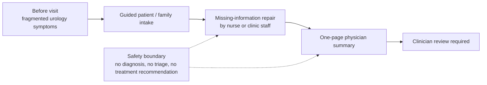
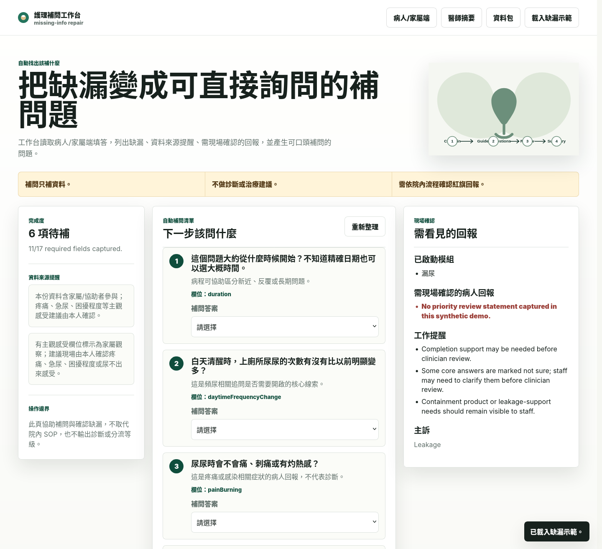
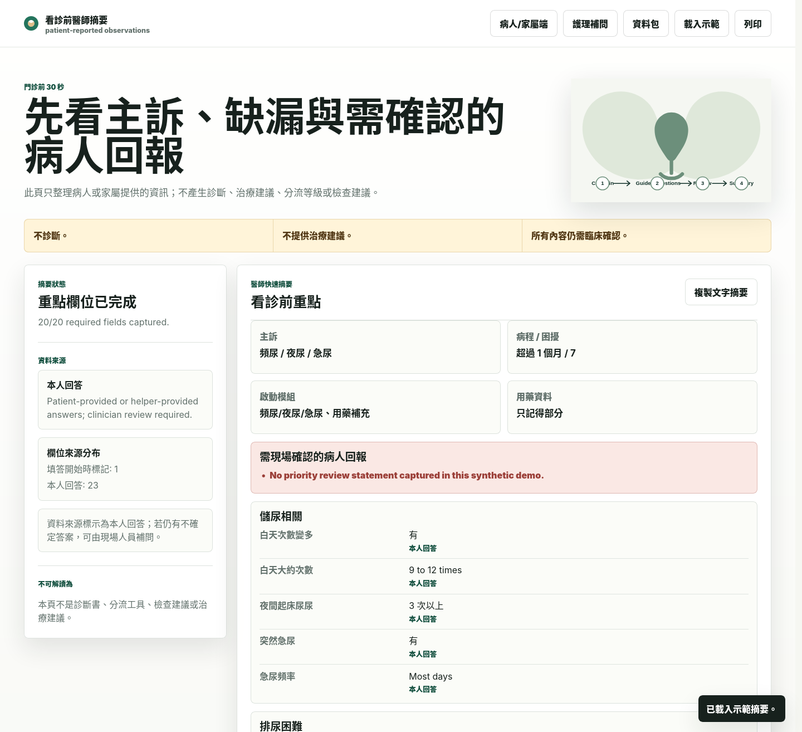
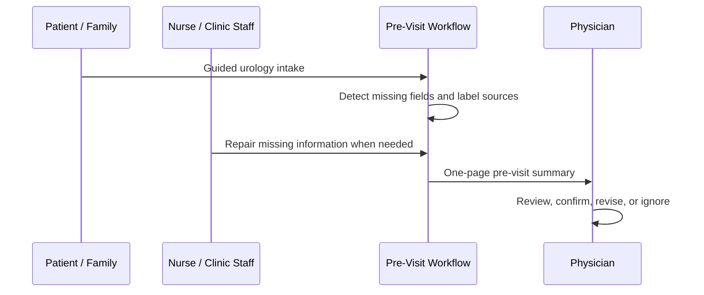
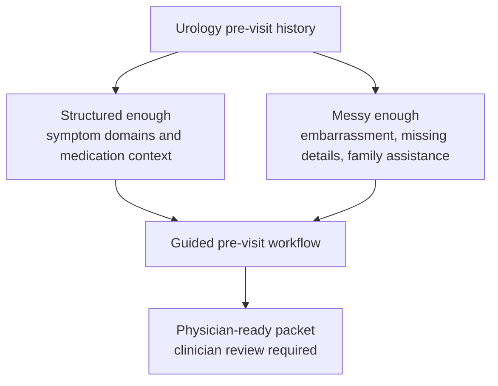
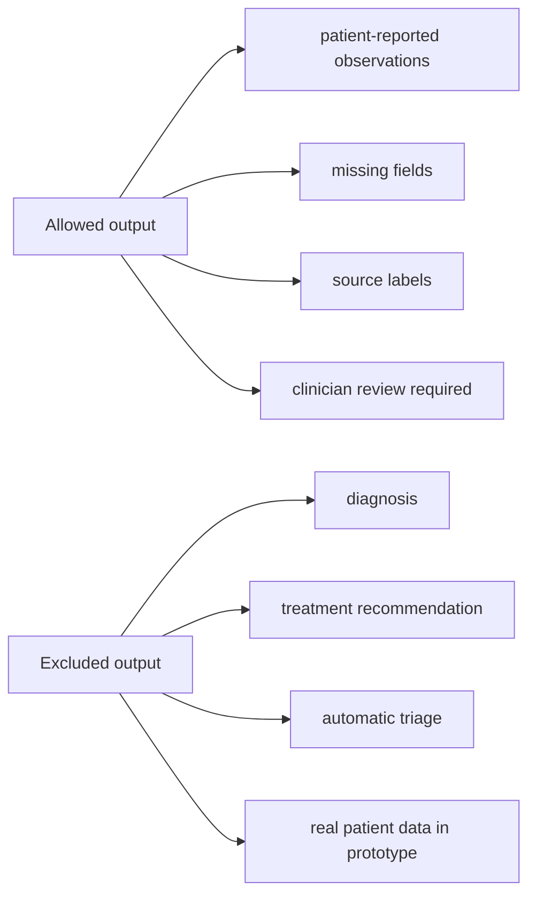
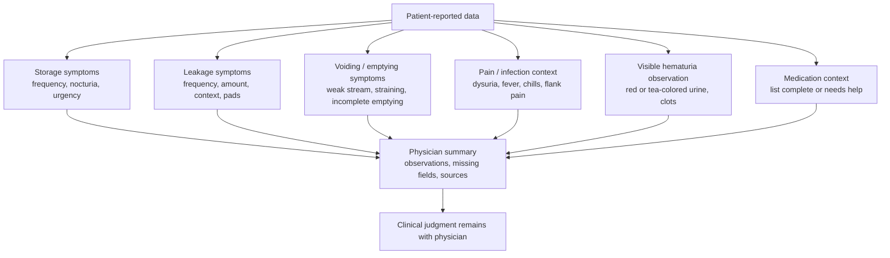
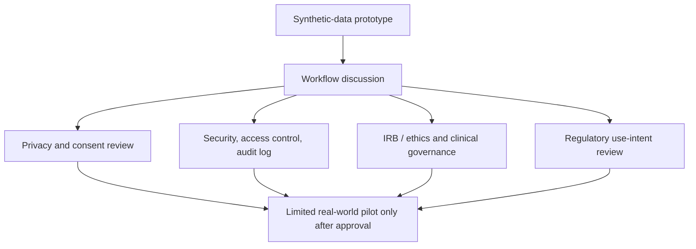

# Urology AI Pre-Visit Demo — Product Agent Version

用途：10 分鐘 product / company-side demo
系統階段：synthetic-data prototype，尚非正式臨床系統
核心定位：urology-specific pre-visit intelligence workflow，協助門診前整理病史、標示缺漏、保留答案來源，讓醫師進診間前看到可覆核的一頁式摘要。

This is not an AI chatbot.
This is a urology-specific pre-visit workflow that reduces fragmented history collection before the physician enters the room.

Clinician review required. Synthetic data only.

---

## 0. One-Minute Product Story

泌尿科門診常常不是從清楚的病史開始，而是從片段症狀開始。

病人可能說「晚上一直起床」、「會漏尿」、「尿不太出來」、「尿有紅色」、「吃很多藥但不知道藥名」。這些內容對泌尿科很重要，但病人不一定能清楚描述 nocturia、leakage、weak stream、hematuria、medication context 或症狀開始時間。

家屬常協助回答，護理師與醫師也常重複釐清同一批資訊。結果是：病史零散、來源不清、缺漏不明，醫師在時間壓力下還要先做資訊整理。

這個系統把病人 / 家屬填答、護理補問、缺漏欄位與來源標記整理成 physician-ready pre-visit packet。醫師看到的是一頁式摘要，而不是一大串聊天紀錄或逐題問卷。

系統不做診斷、不做自動分流、不建議治療。所有輸出都需要 clinician review。

---

## 1. What Problem This Solves

這個 prototype 解決的是門診前資訊混亂，而不是取代醫師判斷。

- 病人病史常被拆成零散片段：主訴、開始時間、頻率、困擾程度、藥單、相關症狀分散在不同回答裡。
- 泌尿症狀常尷尬或不好描述：夜尿、漏尿、急尿、弱尿流、尿不乾淨、血尿觀察都需要更有結構的問法。
- 關鍵 symptom context 常缺漏：例如漏尿量、發生多久、有無發燒畏寒、腰側痛、用藥清單是否完整。
- 家屬協助操作時，病人本人感受與家屬觀察容易混在一起。
- 護理師與醫師常重複問相同問題，卻仍不確定哪些資料完整。
- 醫師進診間前需要快速掃讀，而不是讀長篇自由文字。
- 年長病人可能需要大字體、高對比、分段填答、家屬協助與現場補問。

Product framing: reduce pre-visit information chaos and make the clinic team start from a cleaner story.

---

## 2. The 10-Minute Demo Flow

| Time | What to show | What to say | What the product agent should notice |
|---|---|---|---|
| 0:00-1:00 | Product pain and value | 泌尿科病史常從片段症狀開始；本系統把門診前資訊整理成可覆核的 pre-visit packet。 | 這是 workflow product，不是聊天機器人。 |
| 1:00-2:30 | Patient/family intake screen：`product/screenshots/01-patient-start.png`、`02-patient-chief-concern-active.png` | 病人或家屬用簡短、分段、可協助操作的畫面回答主訴與症狀。 | 入口面向真實病人，尤其是年長者與需要家屬協助者。 |
| 2:30-4:00 | Symptom-triggered modules：`03-patient-bother-scale.png` | 系統依主訴觸發泌尿症狀模組，例如 nocturia、leakage、voiding difficulty、hematuria context。 | Urology-specific structure 比 generic chat 更可控。 |
| 4:00-5:30 | Nurse missing-information repair：`05-nurse-missing-info-repair.png` | 缺漏不被隱藏；護理端看到需要補問的欄位與具體補問 cue。 | 產品價值不只在病人填答，也在 clinic workflow repair。 |
| 5:30-7:00 | Physician one-page summary：`06-clinician-summary-frequency.png` | 醫師看到主訴、症狀群、困擾程度、缺漏、來源與 clinician review required。 | 核心輸出是降低 cognitive load 的一頁式摘要。 |
| 7:00-8:30 | Safety boundary and source labeling：`07-visit-packet-role-separated.png` | 病人回答、家屬觀察、護理補問分開標示；不診斷、不分流、不建議治療。 | Safety boundary 是產品設計的一部分，不是附註。 |
| 8:30-10:00 | Product integration discussion | 討論 owner、clinic timing、EHR/HIS integration、pilot metric、customization fields。 | 下一步是 workflow pilot design，不是直接宣稱 clinical validation。 |

### Demo Screenshots to Show

圖 1：護理補問工作台把缺漏欄位轉成可直接執行的補問任務，展示 prototype 不只收集資料，也支援 clinic workflow repair。

圖 2：醫師摘要把主訴、症狀群、困擾程度、來源與缺漏整理成一頁式 pre-visit packet，展示 product demo 的核心輸出。

---

## 3. First-Sight Demo Moment

最好的第一眼畫面應該是：先讓 product agent 看到「原本混亂的門診前資訊」如何變成「醫師可掃讀的一頁式摘要」。

| Before | After |
|---|---|
| scattered symptom data | chief concern |
| unclear source | answer source |
| missing medication context | medication context visible or marked missing |
| no timeline | symptom timing and duration fields |
| repeated questions | missing fields shown as repair targets |
| family answer mixed with patient feeling | patient answer, family observation, nurse supplement separated |
| long free-text burden | symptom cluster and bother score |
| physician must reconstruct the story | one-page physician summary |
| hidden uncertainty | clinician review required |

Demo guidance: show the physician summary early, then walk backward to patient intake and nurse repair.

---

## 4. Product Value Proposition

- Reduce pre-visit information chaos：把片段症狀整理成可掃讀的 pre-visit packet。
- Make missing information visible：缺漏欄位保留，不由系統猜測或自動補完。
- Separate patient answers from family observations：本人感受、家屬觀察、護理補問分開標示。
- Support nurse repair workflow：護理端看到最值得補問的欄位，而不是重問整份問卷。
- Give physicians a one-minute readable summary：醫師進診間前看到主訴、症狀群、困擾程度、來源與缺漏。
- Keep AI inside a conservative safety boundary：系統只整理與提醒，不診斷、不治療、不自動分流。

No clinical outcome claim. No mortality claim. No clinician replacement claim.

---

## 5. Why Urology Is a Strong Starting Point

Urology is a strong first specialty because the pre-visit history is structured enough to guide, but still messy enough to benefit from workflow support.

- 泌尿科初始評估高度依賴 symptom history。
- 很多症狀尷尬或難描述，例如漏尿、急尿、夜尿、尿不乾淨感。
- 年長病人常需要家屬協助操作，但家屬觀察不能混成病人主觀感受。
- LUTS、nocturia、leakage、voiding difficulty、hematuria observation、medication context 都適合轉成 guided intake fields。
- 臨床判斷仍由 physician 完成；系統只把門診前資訊整理得更清楚。

---

## 6. Product Differentiation

This prototype is designed as a specialty workflow product.

- Specialty-specific workflow：題目、缺漏欄位與摘要都圍繞 urology pre-visit context。
- Structured intake：從主訴、症狀群、困擾程度、時間、用藥與警示脈絡開始。
- Source-aware answers：每個重要欄位都保留本人、家屬協助、家屬觀察或護理補問來源。
- Missing-information repair：缺漏被轉成護理端可執行的補問工作。
- Role-separated views：patient / family、nurse、physician 各自看到不同任務畫面。
- Conservative clinical boundary：輸出是 observation and summary，clinical judgment 留給醫師。
- Synthetic-data prototype：目前可用於 workflow discussion，不宣稱已完成 clinical validation。

---

## 7. Safety Boundary

Safety boundary must stay visible throughout the demo.

- Synthetic data only：目前只使用合成案例，不使用真實病人資料。
- No diagnosis：不輸出疑似 OAB、BPH、UTI、癌症或其他診斷。
- No treatment recommendation：不建議藥物、導尿、檢查或治療。
- No automatic triage：不自動分成低 / 中 / 高風險，也不決定急迫性。
- Clinician review required：所有摘要都需要醫師覆核、修正或忽略。
- Missing fields remain visible：缺漏資訊不被系統推測或隱藏。
- Answer sources remain visible：病人本人、家屬觀察、護理補問分開標示。
- Future real-data use requires privacy, security, IRB/ethics, and clinical governance review.

---

## 8. Product Agent Discussion Questions

- Which clinical role should own this workflow: nurse, physician, front desk, or care coordinator?
- Where should this fit: before visit, check-in, waiting room, or telehealth intake?
- Which EHR/HIS integration would matter first?
- What would count as a successful pilot?
- What fields must be customized for each clinic?
- What compliance boundary should be clarified before real patient data?
- Which first market narrative is strongest: physician time pressure, nurse repair workflow, patient readiness, or documentation quality?
- What minimum evidence package would a clinic partner need before a limited workflow pilot?

---

## 9. Keep Appendix

The following appendix keeps the useful clinical rationale and references from the original clinician-facing report. It supports credibility, but it should not be the first 10-minute product story.

### Appendix A. Evidence and Data Basis

目前原型使用的是合成案例，不使用真實病人資料，也不連接 HIS、EMR、EHR、掛號系統或院內訊息系統。

目前使用的資料類型：

- 病人或家屬填答的 previsit 症狀資料。
- 主訴、開始時間、困擾程度。
- 頻尿、夜尿、急尿、漏尿、排尿困難、尿痛、可見血尿、發燒畏寒、腰側痛等 patient-reported observations。
- 用藥清單完整性與是否需要護理協助。
- 語言、字體、操作協助需求。
- 每個重要欄位的答案來源。
- 缺漏欄位與護理補問紀錄。

內建三個合成情境：

- 晚上常起床尿尿：展示 frequency / nocturia / urgency、bladder diary cue、藥單 review cue。
- 尿不太出來：展示 voiding / emptying symptoms 與「需 clinical review 的病人回報」，但不自動分流。
- 漏尿但資料不完整：展示缺漏資訊如何保留，並由護理工作台協助補問。

### Appendix B. Medical Rationale for Question Domains

系統整理的是症狀域與病人回報 observation，不是診斷名稱。

- Storage symptoms：頻尿、夜尿、急尿。
- Leakage / urinary incontinence：是否漏尿、漏尿頻率、量、誘發情境、是否使用護墊 / 尿布。
- Voiding / emptying symptoms：尿流弱、需要用力、斷斷續續、尿不乾淨、曾經或目前尿不出來。
- Pain / infection-related context：尿痛、灼熱、發燒、畏寒、腰側痛。
- Hematuria observation：病人是否看到紅色 / 茶色尿或血塊；不讓病人判斷 microscopic hematuria。
- Medication / context：是否能提供藥單、是否需要護理師協助確認用藥。

### Appendix C. Source Labeling

泌尿症狀中有很多主觀感受，例如急尿、疼痛、困擾程度、尿不乾淨感。家屬可以協助操作，也可以提供觀察，但系統要把來源標記清楚：

- 本人回答。
- 本人回答，家屬協助操作。
- 家屬 / 協助者觀察。
- 護理師現場補問。

這讓醫師能快速判斷哪些內容需要再向病人本人確認，降低「家屬代答被誤認為病人主觀感受」的風險。

### Appendix D. Missing Information as Product Signal

缺漏資訊本身就是 workflow signal。

若病人沒有回答症狀開始時間、尿痛、有無發燒畏寒、藥單完整性、漏尿量等欄位，摘要會直接標示缺漏。

- 護理師知道下一個最值得補問的是什麼。
- 醫師知道摘要的可信範圍，不會誤以為資料完整。

### Appendix E. Governance Before Real-Data Use

若任何機構未來評估臨床使用，至少需先完成以下前提：

- 僅在清楚標示 clinician review required 的前提下使用摘要。
- 真實資料使用前需確認病人同意、個資保護、權限控管與稽核紀錄。
- 與院內 HIS / EMR / EHR 或其他系統的連接方式，需由院方資安、法遵與臨床治理流程決定。
- 是否涉及醫療器材軟體或 AI / ML SaMD，需依當地法規與正式用途判定。
- 上線前需以實際工作流程驗證可讀性、使用錯誤風險與臨床人員負擔。

### Appendix F. Reference Basis

The evidence basis supports question domains and safety boundaries. It does not claim this prototype has completed clinical validation.

- AUA/SUFU. The AUA/SUFU Guideline on the Diagnosis and Treatment of Idiopathic Overactive Bladder (2024). https://www.auanet.org/guidelines-and-quality/guidelines/idiopathic-overactive-bladder
- AUA/SUFU. Microhematuria Guideline (2025 update). https://www.auanet.org/guidelines-and-quality/guidelines/microhematuria
- AUA/CUA/SUFU. Recurrent Uncomplicated Urinary Tract Infections in Women Guideline (2025). https://www.auanet.org/guidelines-and-quality/guidelines/recurrent-uti
- AUA. Management of Lower Urinary Tract Symptoms Attributed to Benign Prostatic Hyperplasia Guideline. https://www.auanet.org/guidelines-and-quality/guidelines/benign-prostatic-hyperplasia-(bph)-guideline
- NICE CG97. Lower urinary tract symptoms in men: management. https://www.nice.org.uk/guidance/cg97/chapter/recommendations
- NICE NG123. Urinary incontinence and pelvic organ prolapse in women: management. https://www.nice.org.uk/guidance/ng123/chapter/recommendations
- International Continence Society. Bladder diary / frequency volume chart terminology. https://www.ics.org/committees/standardisation/terminologydiscussions/bladderdiary
- ICIQ. International Consultation on Incontinence Questionnaire-Urinary Incontinence Short Form. https://iciq.net/iciq-ui-sf
- AHRQ. Health Literacy Universal Precautions Toolkit. https://www.ahrq.gov/health-literacy/improve/precautions/index.html
- CDC. Health Literacy Communication Strategies. https://www.cdc.gov/health-literacy/php/research-summaries/communication-strategies.html
- FDA. Human Factors and Medical Devices. https://www.fda.gov/medical-devices/device-advice-comprehensive-regulatory-assistance/human-factors-and-medical-devices
- HHS. HIPAA mobile health privacy guidance. https://www.hhs.gov/hipaa/for-professionals/privacy/guidance/cell-phone-hipaa/index.html
- 衛生福利部。強化病人安全管理機制，為病人就醫安全把關。https://www.mohw.gov.tw/cp-2704-19692-1.html
